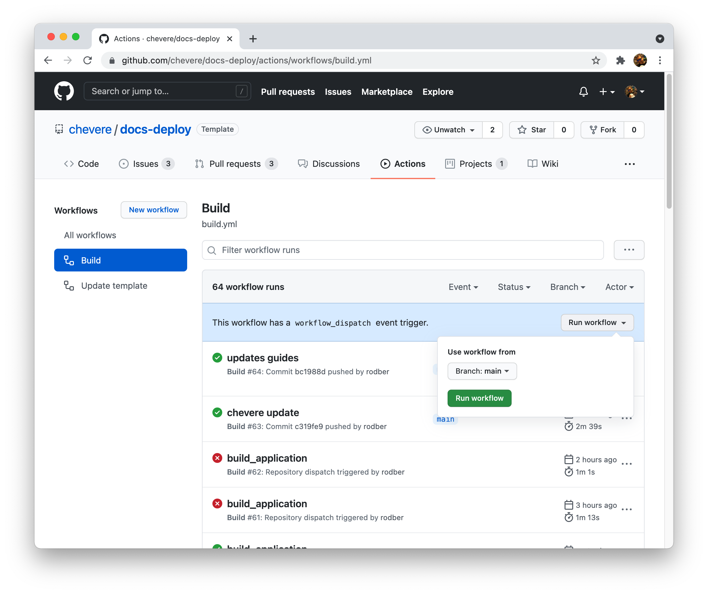
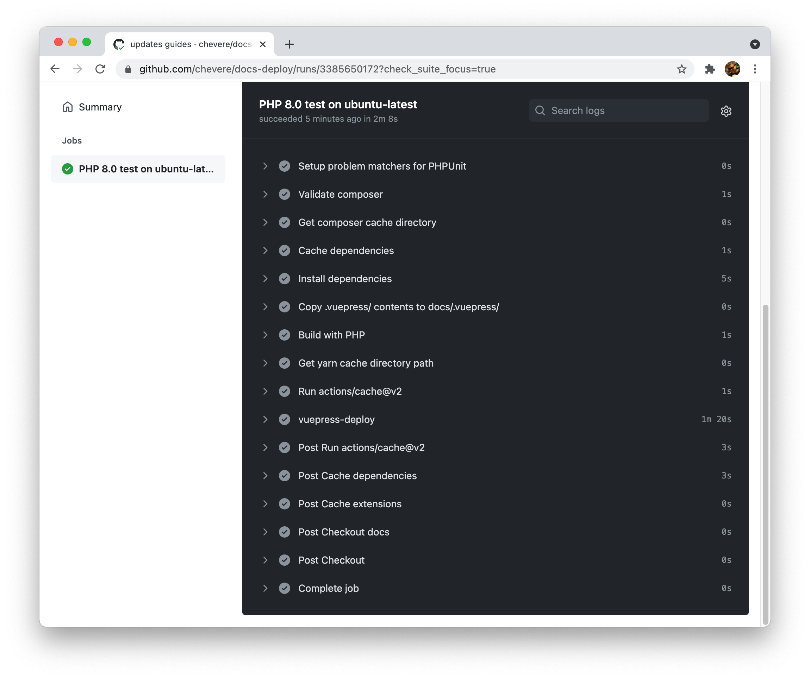

# Deploy

## Manual deploy

Refer to the [CONSOLE GUIDE](guides/console/DEPLOY.md).

## GitHub workflow-based deployment

1. Go to **Actions**
2. Select **Build** under **Workflows**
3. Click on **Run Workflow** and confirm

✅ When done **the documentation will be available** at your target repository.

