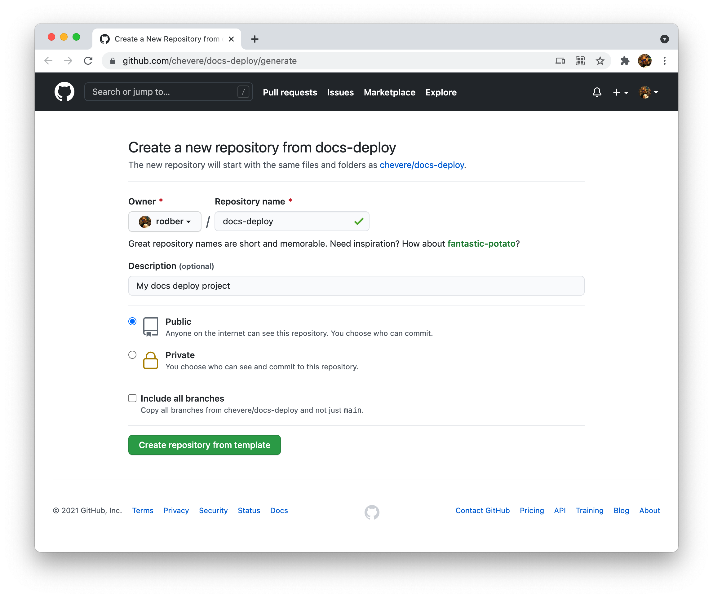

# Setup

## Manual setup

Refer to the [CONSOLE GUIDE](guides/console/SETUP.md).

## GitHub actions setup

* Require to create three (3) repositories:
  * (A) Repo for hosting your documentation website (for free!)
  * (B) Repo for documentation (markdown files)
  * (C) Repo for docs deploy (documentation website builer)

* Requires to provide PAT ([Personal Access Tokens](https://docs.github.com/en/authentication/keeping-your-account-and-data-secure/creating-a-personal-access-token)) with `repo` scope granted.

### (A) Hosting repo

* Create a new repository to use is as (free) hosting for your documentation website.

### (B) Docs repo

* Create a new repository to use it as your **docs repo** (markdown files) source.

💡 You can use [chevere/docs-template](https://github.com/chevere/docs-template) as base.

When done:

1. Go to **Secrets** under **Settings** from your new repo
2. Click on **New repository secret**
3. Provide the following repository **secrets**:

| Key                      | Description / example                                          |
| ------------------------ | -------------------------------------------------------------- |
| `REPO_DOCS_DEPLOY`       | [Docs deploy](#c-docs-deploy-repo) repo as `owner/docs-deploy` |
| `REPO_DOCS_DEPLOY_TOKEN` | PAT to access `REPO_DOCS_DEPLOY`                               |

### (C) docs-deploy repo

* Click the [Use this template](https://github.com/chevere/docs-deploy/generate) button to create your docs-deploy repo.

When done:

1. Go to **Secrets** under **Settings** from your new repo
2. Click on **New repository secret**
3. Provide the following repository **secrets**:

| Key                         | Description / example                                |
| --------------------------- | ---------------------------------------------------- |
| `REPO_DOCS`                 | [Docs repo](#b-docs-repo) as `owner/docs-repo`       |
| `REPO_DOCS_ACCESS_TOKEN`    | PAT to access `REPO_DOCS`                            |
| `REPO_HOSTING`              | [Hosting repo](#a-hosting-repo) as `owner/host-repo` |
| `REPO_HOSTING_ACCESS_TOKEN` | PAT to access `REPO_HOSTING`                         |
| `CNAME`                     | Hostname for your website as `mydomain.com`          |

## Automatic deployment on docs repo update

Check the [push-deploy.yml](https://github.com/chevere/docs-template/blob/main/.github/workflows/push-deploy.yml) workflow used to automatic trigger workflows on the deploy repo from the docs repo.
